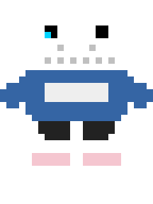

<!-- ════════════════════════════════════════════════════════════════════ -->
<!--                    ❤️ PIXEL QUEST: JOÃO LUCAS ❤️                  -->
<!--           A GitHub Profile README — Undertale / Pixel Art Style   -->
<!-- ════════════════════════════════════════════════════════════════════ -->

<div align="center">

<!-- ═══════════ UNDERTALE HEART ═══════════ -->


<br><br><br>

<!-- ═══════════ ANIMATED TYPING HEADER ═══════════ -->

<a href="https://git.io/typing-svg">
  
</a>

<br>

<!-- ═══════════ UNDERTALE DIALOGUE BOX ═══════════ -->

```
╔══════════════════════════════════════════════════════════════════════╗
║                                                                      ║
║   * João Lucas appears!                                              ║
║                                                                      ║
║   ❤ LV 21       HP ██████████████████████████████████████████  99/99 ║
║                                                                      ║
║   "heh. you really wanna know about me, kid?                         ║
║    ...guess i can spare some info."                                  ║
║                                                                      ║
║   ┌────────────┐  ┌────────────┐  ┌────────────┐  ┌────────────┐    ║
║   │  ❤ FIGHT   │  │    ACT     │  │    ITEM    │  │   MERCY    │    ║
║   └────────────┘  └────────────┘  └────────────┘  └────────────┘    ║
║                                                                      ║
╚══════════════════════════════════════════════════════════════════════╝
```

</div>

<!-- ═══════════════════════════════════════════════════════════════════ -->
<!--                         ☠️ ABOUT ME                               -->
<!-- ═══════════════════════════════════════════════════════════════════ -->

<h2>
  
  <samp>&gt; ABOUT_ME.exe</samp>
</h2>

```
 _______________________________________________
|  _________________________________________  |
| |                                         | |
| |  C:\USERS\JOAO_LUCAS> whoami            | |
| |                                         | |
| |  Name: João Lucas Fernandes Cantanhede  | |
| |  Class: Mechanical Engineer + Dev       | |
| |  Location: Uberaba, MG 📍              | |
| |  Guild: Startup Pr3VIA                  | |
| |  Title: Front-End Developer             | |
| |                                         | |
| |  STATUS:                                | |
| |  ├─ 🎓 Eng. Mecânica @ UFTM            | |
| |  ├─ 💻 Front-End Dev @ Pr3VIA          | |
| |  ├─ 📐 Técnico em Administração (IFMA) | |
| |  └─ ❤️  Determined to code!             | |
| |                                         | |
| |  C:\USERS\JOAO_LUCAS> _                | |
| |_________________________________________|  |
|_______________________________________________|
```

<br>

<!-- ═══════════════════════════════════════════════════════════════════ -->
<!--                      ⚔️ SKILLS / TECH STACK                       -->
<!-- ═══════════════════════════════════════════════════════════════════ -->

<h2>
  <samp>&gt; INVENTORY.dat — Skills & Tech Stack</samp>
</h2>

<div align="center">

```
+----------------------------------------------------------+
|                  // EQUIPPED SKILLS //                    |
+----------------------------------------------------------+
|                                                          |
|   FRONT-END      [####################----]  90%         |
|   REACT          [####################----]  90%         |
|   TYPESCRIPT     [################--------]  70%         |
|   SASS / CSS     [####################----]  90%         |
|   GIT / GITHUB   [####################----]  90%         |
|   TAILWIND CSS   [##################------]  80%         |
|   UX DESIGN      [################--------]  70%         |
|   AUTOCAD        [#############-----------]  55%         |
|   LEADERSHIP     [######################--]  95%         |
|                                                          |
+----------------------------------------------------------+
```

<!-- ═══════════ SKILL ICONS ═══════════ -->

<br>

<a href="https://skillicons.dev">
  
</a>

<br><br>

</div>

<!-- ═══════════════════════════════════════════════════════════════════ -->
<!--                      📜 QUEST LOG / EXPERIENCE                    -->
<!-- ═══════════════════════════════════════════════════════════════════ -->

<h2>
  <samp>&gt; QUEST_LOG.sav — Experience & Achievements</samp>
</h2>

```
+----------------------------------------------------------------------------+
|  QUEST LOG                                                     SAVE <3     |
+----------------------------------------------------------------------------+
|                                                                            |
|  // MAIN QUESTS                                                            |
|  ------------------------------------------                                |
|                                                                            |
|  [###########--] Front-End Dev @ Startup Pr3VIA    (Abr/2026 -> Now)       |
|  |  * Desenvolvimento de sistemas com React + Tailwind CSS                 |
|  |  * Criacao de interfaces funcionais e integracao de componentes         |
|  |  * Otimizacao da plataforma com foco em performance e UI                |
|  |                                                                         |
|  [#############] Tesoureiro Geral - Gremio IFMA    (Jan/2025 -> Jan/2026)  |
|  |  * Gestao financeira completa e controle de fluxo de caixa              |
|  |  * Elaboracao de orcamentos para projetos estudantis                    |
|  |                                                                         |
|  // EDUCATION PATH                                                         |
|  ------------------------------------------                                |
|                                                                            |
|  [####---------] Eng. Mecanica -- UFTM             (Mar/2026 -> ...)       |
|  [#############] Tec. Administracao -- IFMA         (Fev/2023 -> Dez/2025) |
|                                                                            |
|  // ACHIEVEMENTS UNLOCKED                                                  |
|  ------------------------------------------                                |
|                                                                            |
|  [*] Startup Pr3VIA --- Desenvolvimento e producao de sistema web          |
|  [*] Certificacao BFD - Front-End React (200h) -- Softex                   |
|  [*] JIFMA ----------- Prata: Tenis de Mesa | Bronze: Volei                |
|  [*] CNH Categoria B - Habilitacao (Fev/2026)                              |
|                                                                            |
+----------------------------------------------------------------------------+
```

<br>

<!-- ═══════════════════════════════════════════════════════════════════ -->
<!--                      🏆 CERTIFICATIONS                            -->
<!-- ═══════════════════════════════════════════════════════════════════ -->

<h2>
  <samp>&gt; ITEMS.inv — Certifications & Courses</samp>
</h2>

<div align="center">

```
┌──────────────────────────────────────────────────────────────────┐
│  🎒  INVENTORY — Certifications                                  │
├──────────────────────────────────────────────────────────────────┤
│                                                                  │
│  📜 Front-End React (200h)       ─── Bolsa Futuro Digital/Softex │
│  📜 Desenho Técnico              ─── GINEAD Online               │
│  📜 Inglês Intermediário         ─── GINEAD Online               │
│                                                                  │
│  🗣️  IDIOMAS                                                     │
│  ├─ 🇺🇸 Inglês ──── Intermediário                                │
│  └─ 🇪🇸 Espanhol ── Básico                                      │
│                                                                  │
└──────────────────────────────────────────────────────────────────┘
```

</div>

<br>

<!-- ═══════════════════════════════════════════════════════════════════ -->
<!--                   📊 GITHUB STATS — PIXEL STYLE                   -->
<!-- ═══════════════════════════════════════════════════════════════════ -->

<h2>
  <samp>&gt; STATS.rpg — GitHub Analytics</samp>
</h2>

<div align="center">

<!-- Pixel Profile Stats -->
<a href="https://github.com/Joao-LucasFe">
  
</a>

<br><br>

<!-- GitHub Streak Stats -->
<a href="https://github.com/Joao-LucasFe">
  
</a>

<br><br>

<!-- Top Languages -->
<a href="https://github.com/Joao-LucasFe">
  
</a>

</div>

<br>

<!-- ═══════════════════════════════════════════════════════════════════ -->
<!--                        🐍 SNAKE ANIMATION                        -->
<!-- ═══════════════════════════════════════════════════════════════════ -->

<h2>
  <samp>&gt; SNAKE.game — Contribution Graph</samp>
</h2>

<div align="center">

<picture>
  <source media="(prefers-color-scheme: dark)" srcset="https://raw.githubusercontent.com/Joao-LucasFe/Joao-LucasFe/output/github-snake-dark.svg">
  <source media="(prefers-color-scheme: light)" srcset="https://raw.githubusercontent.com/Joao-LucasFe/Joao-LucasFe/output/github-snake.svg">
  
</picture>

</div>

<br>

<!-- ═══════════════════════════════════════════════════════════════════ -->
<!--                     📬 CONTACT / SOCIAL                           -->
<!-- ═══════════════════════════════════════════════════════════════════ -->

<h2>
  <samp>&gt; CONNECT.link — Find Me</samp>
</h2>

<div align="center">

```
╔══════════════════════════════════════════════════════════════╗
║                                                              ║
║   * You found a SAVE POINT.                                  ║
║                                                              ║
║   ❤ Seeing this fills you with DETERMINATION.                ║
║                                                              ║
║   ...connect with me?                                        ║
║                                                              ║
║   ┌──────────┐  ┌──────────┐                                 ║
║   │  ❤ YES   │  │    NO    │                                 ║
║   └──────────┘  └──────────┘                                 ║
║                                                              ║
╚══════════════════════════════════════════════════════════════╝
```

<br>

<a href="mailto:joaolucasfernandescantanhede@gmail.com">
  
</a>
&nbsp;
<a href="https://www.linkedin.com/in/jo%C3%A3o-lucas-fernandes-cantanhede-b936a9391">
  
</a>
&nbsp;
<a href="https://instagram.com/joaolucas4i_">
  
</a>
&nbsp;
<a href="https://github.com/Joao-LucasFe">
  
</a>

<br><br>

<!-- ═══════════ PROFILE VIEWS COUNTER ═══════════ -->


</div>

<br>

<!-- ═══════════════════════════════════════════════════════════════════ -->
<!--                      🦴 SANS FOOTER                               -->
<!-- ═══════════════════════════════════════════════════════════════════ -->

<div align="center">



<br>

```
  * heya. thanks for stopping by, kid.
        ...don't forget to star.

    ───── it's a beautiful day outside.
       birds are singing, flowers are
             blooming... ─────
```

<!-- ═══════════ UNDERTALE HEART FOOTER ═══════════ -->


<br>

<samp>
  <b>❤ Made with DETERMINATION ❤</b>
  <br>
  <i>* But it refused.</i>
</samp>

</div>
